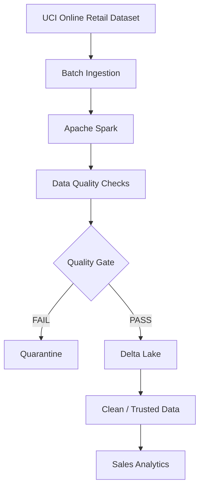

# E-commerce Sales Data Quality & Analytics Pipeline

## Project Overview
This project implements a modern data engineering pipeline for e-commerce sales data using Apache Spark and Delta Lake. The pipeline ingests real-world retail transaction data, performs data quality checks, separates valid and invalid records through a quality gate, stores trusted data in Delta Lake, quarantines failed records, and produces sales analytics.

## Problem Description
Real-world transactional data may contain missing values, duplicate records, and invalid values that can affect downstream analytics.

The goal of this project is to build a reliable data pipeline that validates incoming e-commerce transaction data before it is used for analytics. Records that pass the quality rules are stored as trusted data, while failed records are sent to quarantine with their failure reasons.

## Data Source
The project uses the **Online Retail** dataset from the UCI Machine Learning Repository.

Dataset characteristics:
- 541,909 transaction records
- 8 original attributes
- Real-world online retail transaction data
- Batch ingestion

Source: https://archive.ics.uci.edu/dataset/352/online+retail

## Workflow / Architecture

The pipeline follows this flow:

**Data Source → Batch Ingestion → Apache Spark → Data Quality → Quality Gate → PASS/FAIL → Delta Lake or Quarantine → Trusted Data → Analytics**

## Data Quality Checks
The pipeline applies four data quality checks:

1. **Completeness – Description**  
   The product description must not be null or empty.

2. **Completeness – CustomerID**  
   The customer identifier must not be null.

3. **Accuracy / Business Rule – UnitPrice**  
   UnitPrice must be greater than zero.

4. **Uniqueness – Duplicate Records**  
   Exact duplicate transaction records are identified and rejected.

A record receives **PASS** only when all quality checks are satisfied. Otherwise, it receives **FAIL** and is sent to quarantine with a failure reason.

### Quality Gate Results
- Total raw records: **541,909**
- PASS / Trusted records: **401,564**
- FAIL / Quarantined records: **140,345**
- Duplicate records detected: **5,268**

## AI / RAG or Analytics Output
This project uses the **Analytics** option.

After trusted records are loaded from Delta Lake, positive sales transactions are prepared for analysis by calculating:

**TotalSales = Quantity × UnitPrice**

The analytics include:
- Total sales by country
- Top products by quantity sold
- Monthly sales trends

## Results
The pipeline successfully transformed raw retail data into validated and trusted data for analytics.

Key results:
- **401,564** records passed the quality gate.
- **140,345** records were quarantined.
- **392,692** positive sales records were prepared for analytics.
- The **United Kingdom** had the highest total sales in the dataset.
- Monthly sales analysis showed the highest total in **November 2011**.

The project demonstrates how data quality validation can prevent invalid records from entering the trusted analytics layer.

## Technologies Used
- Python
- Pandas
- Apache Spark / PySpark
- Delta Lake
- Google Colab
- GitHub
- Parquet

## How to Run the Project
1. Download the **Online Retail** dataset from the UCI Machine Learning Repository.
2. Open the project notebook in Google Colab.
3. Run the dependency installation cell.
4. Upload `Online Retail.xlsx` when prompted.
5. Run the remaining notebook cells in order.
6. The dataset is converted to CSV and ingested into Apache Spark.
7. Data quality checks and the quality gate are applied.
8. PASS records are stored in Delta Lake.
9. FAIL records are stored in the quarantine layer.
10. Run the analytics cells to view the final results.

## Future Improvements
Future improvements could include:
- Real-time streaming ingestion
- Additional business-rule validation
- Automated data quality monitoring
- Interactive analytics dashboards
- Integration with cloud-based data lake storage
- Machine learning or RAG-based analysis on trusted data

## SDAIA Academy GitHub Repository Link
https://github.com/SDAIAAcademy
